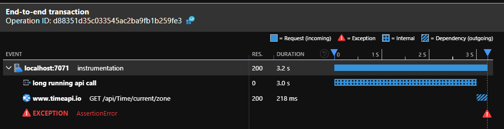
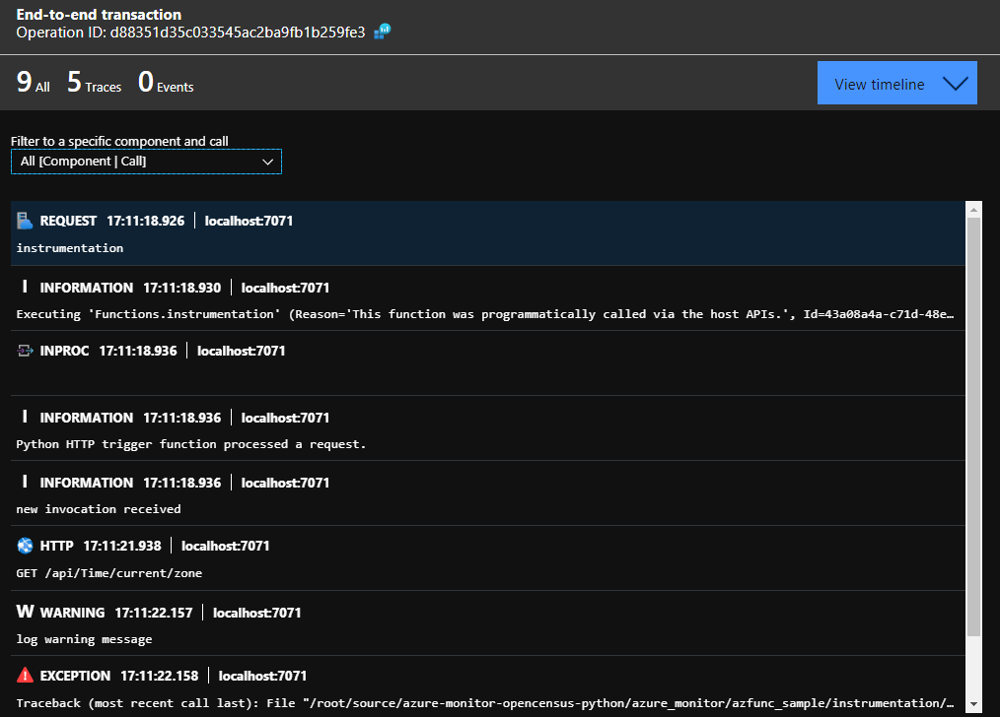
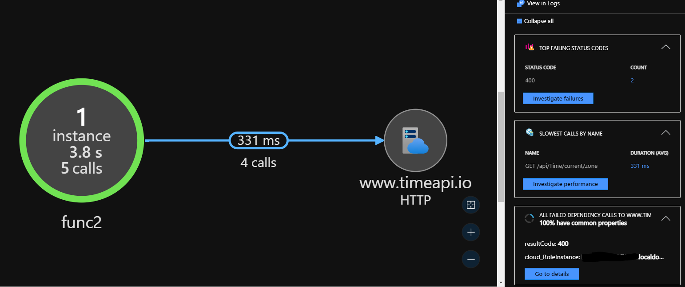

# Correlated End-To-End Azure Function (Python) Instrumentation with Opencensus 

## Overview

Azure Function (Python) already supports instrumentaton using Opencensus. Unfortunately, the current out-of-the-box (OOTB) implementation/support has some flaws (see below), which make it difficult to get a correlated end-to-end view of a single function invocation (in Azure Monitor/Application Insights).

It is also important to assign the correct cloud role name and cloud instance name to different log records sent to Application Insights (for additional insights). This is especially relevant for distributed, scalable applications sending logs to a single Application Insights instance.

### Example of a Correlated End-to-End Azure Function Invocation

End-to-end transaction:



Associated application trace messages:



Associated AI Application Map:



The images shows the following elements:

- Correlated (per Azure Function invocatio) log information incl
    - Incoming request information
    - Appication traces & error messages
    - External dependencies (IN-PROC & HTTP using Python's requests)
- Application Map (defined cloud role and cloud instance values)

### Known Limitations in Current OOTB Logging Integration (Azure Function)

- External dependency log records don't have the correct *Cloud Role Name* (field: cloud_RoleName). This results in wrong information displayed in Application Insight's *Application Map*. See <https://github.com/census-instrumentation/opencensus-python/issues/1052>
- Errors (logged with the OOTB logging integration) are not correctly logged as Application Insights Exception records. Currently `logging.exception(..)` creates a trace record (with severity level 3 = Error). This comes with certain side effects: E.g. errors are won't show up in Application Insights dashboard (*Failures*) and troubleshooting becomes harder (see issue <https://github.com/Azure/azure-functions-python-worker/issues/866>)

## Goal 

The goal of this code sample is to demonstrate an alternative (custom) approach of instrumenting Azure Function code using Opencensus. This should give developers more insights how to use Opencensus and how to overcome the limitations of the OOTB implementation.

> *Important. Once the issues (see below) are resolved in the platform, it is recommended to move to the OOTB implementation!* 

## Run Locally

### Setup

1. Install [Azure Functions Core Tools](https://docs.microsoft.com/en-us/azure/azure-functions/functions-run-local?tabs=linux%2Ccsharp%2Cbash).
1. Install Azure Storage Emulator [Azurite](https://docs.microsoft.com/en-us/azure/storage/common/storage-use-azurite) & start Azurite's Blob service 
1. Install all package dependencies locally using `pip install -r requirements.txt`.
1. Create a file named `local.settings.json` which contains the following configuration information (*replace the placeholders*)

    ```json
    {
    "IsEncrypted": false,
    "Values": {
        "AzureWebJobsStorage": "UseDevelopmentStorage=true",
        "FUNCTIONS_WORKER_RUNTIME": "python",
        "PYTHON_ENABLE_WORKER_EXTENSIONS": "1",
        "APPLICATIONINSIGHTS_CONNECTION_STRING": "InstrumentationKey=[YOUR-APPLICATION-INSIGHTS-KEY]",
        "WEBSITE_SITE_NAME": "[YOUR-APPLICATION-INSIGHTS-CLOUD-ROLE-NAME e.g. MyFunction]",
        "EXTERNAL_DEPENDENCY_URL":"[SOME-WEB-URL-FOR-DEPENDENCY-TRACKING e.g. https://www.bing.com]"
        }
    }
    ```

### Test

1. Run tests with `pytest`

### Run

1. Start the Azure Function host: `func host start`
1. Send HTTP request. `curl http://localhost:[PORT]/api/instrumentation`

## Contributors
[Oliver Lintner](https://github.com/se02035)  