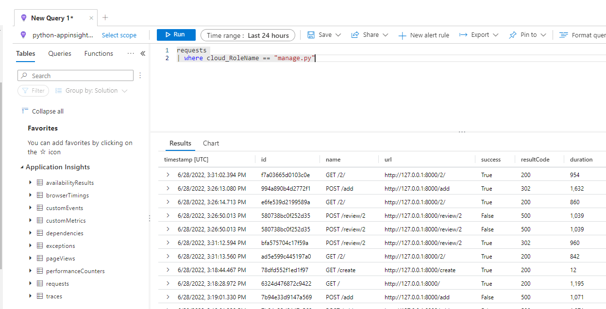
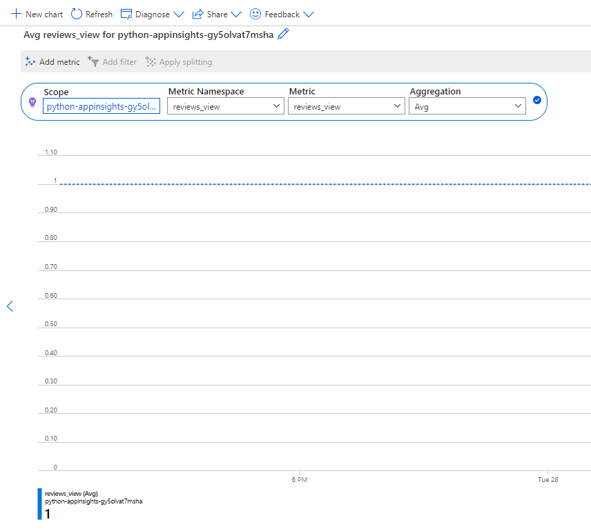

# Sample: Configuring Django applications with OpenCensus

This next example shows how to add the various OpenCensus settings to a Django application to send logging and metric data to Azure Monitor.  You will run the samples both locally and deploy the Django web application to the Azure App Service resource you deployed as part of the setup script.

## 1 - Environment Setup

Follow the steps in the [setup documentation](/azure_monitor/readme.md).

## 2 - Configure Environment

- Run the following commands to setup the environment:

```powershell
cd $home

cd .\azure_monitor\django_sample
```

```python
python -m pip install django
python -m pip install python-dotenv
python -m pip install opencensus-ext-django
python -m pip install opencensus-ext-postgresql

python -m pip install -r requirements.txt
```

- The following items have been done for you in the ARM template:
  - System assigned managed identity for the app service is enabled.
  - Storage Blob Data Contributor has been assigned to the managed identity.

- Setup local PostgreSQL connectivity
  - Browse to the Azure Portal.
  - Select your lab subscription and resource group.
  - Select the **python-appinsights-SUFFIX-pg** Postgres SQL resource.
  - Under **Settings**, select **Connection security**.
  - Select **Add client IP**.
  - Select **Save**.

- Setup the Application insights middleware
  - Open the `./azure_monitor/django_sample/azureproject/settings.py` file.
  - Ensure the following line is present in the `MIDDLEWARE` section:

```python
'opencensus.ext.django.middleware.OpencensusMiddleware',
```

-- Ensure the following `OPENCENSUS` section is present in the `settings.py` file.

```python
OPENCENSUS = {
    'TRACE': {
        'SAMPLER': 'opencensus.trace.samplers.ProbabilitySampler(rate=1)',
        'EXPORTER': 'opencensus.ext.azure.trace_exporter.AzureExporter(connection_string="' + appKey + '")',
    }
}
```

## 3 - Create Database

- Create the database schema:

```python
py manage.py migrate
```

- If you get an error about `psutil._psutil_windows` do the following:
  - Open the `\azure-monitor\.venv\Lib\site-packages` folder and delete the `psutil` and `psutil-5.9.1.dist-info` folders.
  - Then run the following:

    ```Python
    python -m pip install --upgrade pip
    python -m pip install psutil
    ```

## 4 - Test Application

- Run the application and test the logging.

```python
python manage.py runserver
```

- Open a web browser to `http://127.0.0.1:8000/`.
- Add a new resturant.
  - Select **Add new resturant**.
  - For the name, type `Contoso BBQ`.
  - For the address, type `1 Microsoft Way`.
  - For the description, type `BBQ`.
  - Select **Submit**, the resturant will be created.
  - Select **Add new review**.
  - Type a name.
  - Select a rating.
  - Add a comment.
  - Choose a random picture.
  - Select **Save changes**.

## 4 - Review Log Data

- Switch to the Azure Portal.
- Browse to the **python-applicationinsights-SUFFIX** Application Insights resource.
- Under **Monitoring**, select **Logs**.
- In the query window, type the following:

```kql
requests 
| where cloud_RoleName == "manage.py"
```

- Select **Run**, you should see the following:

  

- Select the **Azure** icon in the toolbar of Visual Studio code.
- If prompted, select **Sign in to Azure..** and follow the prompts.
- Expand **Resources**, if needed, sign-in to Azure.
- Expand your target lab subscription.
- Expand **App Services**.
- Locate the target web app to deploy too, this will be **python-appinsights-SUFFIX-app**.
  - If needed, select **Install extension to enable additional features**, then select **Install** to instal the Azure App Service extension.
- In Visual Studio Code, right-click the **django_sample** folder, select **Deploy to web app**.
- Selec the **python-appinsights-SUFFIX-app** web app.
- If prompted, select **Deploy**.
- Browse to the **python-appinsights-SUFFIX-app.azurewebsites.net** web site, the site should load successfully.
- Add some more resturants and reviews, this will cause log data to be sent to Azure Monitor via OpenCensus.

## 5 - Review Custom Metrics

For the sample resturant application, you have two places where metrics are sent to Application Insights.

- Single Value - The number of resturants created.
- Aggregation - Page views over a one minute time period.

- Switch to the Azure Portal and the application insights instance.
- Under **Monitoring**, select **Metrics**.
- For the **Metric namespace**, select **reviews_view**.
- For the **Metric**, select **reviews_view**.
- You should see some data displayed for the reviews made from the web site:

    