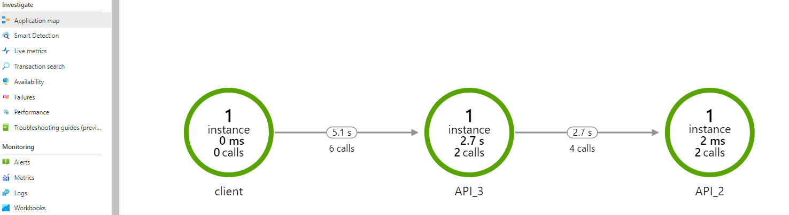

# Overview

This document covers the python logger class using [OpenCensus-Python sdk][1] for [Azure Application Insights][3].

## Application Monitoring

Application monitoring is one of the important pillars for any software development project. To support monitoring and observability, software projects should be able to perform below tasks:

* Ability to generate logs and send them to analytics workspace.
* Ability for monitor exceptions.
* Ability to send custom metrics or events from the application.

Currently application monitoring for python projects is integrated with [Azure Application Insights][3] using [opencensus-python sdk][1].

## Why there is a need for Python Logger Class?

Currently [Azure Application Insights][3] supports logging, distributed tracing, metric collection using [opencensus-python sdk][1]. To integrate any python project with `opencensus sdk`, user has to write a lot of bootstrap code and this needs to be repeated for all the python projects in the application.  
By implementing Python Logger class, all the bootstrap logic can be encapsulated inside a single class which then can be reused by multiple projects.

For example, here is the link to Azure documentation for [opencensus-python sdk][1] and to add a very basic logger and tracer to a flask application following code is required:

```python

import logging
from opencensus.ext.azure.log_exporter import AzureLogHandler
from opencensus.trace.samplers import ProbabilitySampler
from opencensus.ext.azure.trace_exporter import AzureExporter
from opencensus.trace.tracer import Tracer
from opencensus.trace import config_integration
from opencensus.ext.flask.flask_middleware import FlaskMiddleware

APP_NAME = "Flask_App"
APP = Flask(APP_NAME)

config_integration.trace_integrations(["requests"])
config_integration.trace_integrations(["logging"])

def callback_add_role_name(envelope):
    """ Callback function for opencensus """
    envelope.tags["ai.cloud.role"] = APP_NAME
    return True

app_insights_cs = "InstrumentationKey=" + APP_INSIGHTS_KEY
logger = logging.getLogger(__name__)
handler = AzureLogHandler(connection_string=app_insights_cs)
handler.add_telemetry_processor(callback_add_role_name)
logger.setLevel(logging.INFO)
logger.addHandler(handler)

azure_exporter = AzureExporter(connection_string=app_insights_cs)
azure_exporter.add_telemetry_processor(callback_add_role_name)

FlaskMiddleware(
    APP, exporter=azure_exporter, sampler=ProbabilitySampler(rate=1.0),
)

tracer = Tracer(exporter=azure_exporter, sampler=ProbabilitySampler(1.0))

```

This is the bare minimum code required for creating logger and tracer. However, to make it production ready, more complex logic is required.  
Following are some of the scenarios which are not covered in basic implementation.  

* Set logging config values from a json file.
* Read application insights key from environment variable or configuration passed during initialization of loggers.
* Add support for various integrations like flask, sql, httplib, django, pymysql  etc
* Adding default dimensions to the logger so that those dimensions get logged with every logging statement.
* Adding [cloud role name][4]. This is required to give the name of component which is required to identify components in [Application map][4].
* Add disabled logger which can be used during Unit testing.

Assuming, if we need to add code for above scenarios, then this will get repeated for every python project in our application. To avoid repetition and hence enabling code reuse, this python logger class is required. 

## Prerequisites for using AppLogger

* An Azure subscription
* Create an [Application Insights resource](https://docs.microsoft.com/en-us/azure/azure-monitor/app/create-new-resource) and store the application insights instrumentation key
 which is used in python logger class.
* Python installation above 3.7.0 version.

## Design

### AppLogger

AppLogger is the logging class which contains bootstrap code to initialize logger using opencensus python sdk.

```python
class AppLogger:
    def __init__(self, config=None):
        """Create an instance of the Logger class.

        Args:
            config:([dict], optional):
                Contains the setting for logger {"log_level": "DEBUG","logging_enabled":"true"",
                                    "app_insights_key":"<app insights key>"}
        """
        ...

    def get_logger(self, component_name="AppLogger", custom_dimensions={}):
        ...
    def get_tracer(self, component_name="AppLogger", parent_tracer=None):
        ...

```

Parameters used in initialization AppLogger:

* **config**:(optional): This is an optional parameter. Its a python `dict` which takes config values required for logger.

```json
config = {
        "log_level": "DEBUG",
        "logging_enabled": "true",
        "app_insights_key": "<app_insights_instrumentation_key>",
    }
```

  1. **log_level**(optional): Log level can be set by passing desired value in config dict.  
    Following log levels are supported
        * "INFO"
        * "DEBUG"
        * "WARN"
        * "ERROR"
        * "CRITICAL"

  > Default value for `log_level` is set to "INFO"

  2. **logging_enabled**(optional): This is used to enable or disable the logging. By default its value is set to "true". To disable logging `logging_enabled` can be set to `false`. This is useful when we need to run unit tests and don't want to send telemetry. Following could be scenarios where logging can be turned off:    
      1. Unit Tests
      1. Local development  

> Please make sure to set application insights key even when logging_enabled is set to "false" otherwise, it will throw exception during creation of logger.

  3. **app_insights_key**: This contains the value of application insights key. If **not set** here, it should be set as an environment variable as `APPINSIGHTS_INSTRUMENTATION_KEY="YOUR KEY"`. 

> If application insights key is neither set in config, nor in environment variable, initialization of AppLogger will fail with exception.

* **Function `get_logger`**

    ```python
     def get_logger(self, component_name="AppLogger", custom_dimensions={}):
    ```

    `get_logger` function adds AzureLogHandler to the logger and also adds `ai.cloud.role`= [component_name][6] to the logger. It also adds the default dimensions and returns a logger object.

* **Function `get_tracer`**

    ```python
     def get_tracer(self, component_name="AppLogger", parent_tracer=None):
    ```

    `get_tracer` function return a Tracer object. It sets the [component_name][6] to `ai.cloud.role` which is used to identify component in application map. It also sets parent_tracer for proper correlation.

* **Function `enable_flask`**

    ```python
    def enable_flask(self,flask_app,component_name="AppLogger"):
    ```

    `enable_flask` function enables Flask middleware as mentioned in the [documentation.][5] This is required to enable tracing for flask applications.

    Currently function for enabling flask is added but if application requires [integration][7] with other libraries like httplib, django, mysql, pymysql, pymongo, fastapi, postgresql etc then corresponding functions need to be added.

* **Parameters used in `get_logger` and `get_tracer` functions in AppLogger**:

  * **component_name**: (optional): Default value of this param is "AppLogger". Its always best practice to pass this parameter as the name of component in which logger is initialized eg "API3" etc. This will be help in filtering logs in application insights based on the `component_name`. This will appear as `cloud_RoleName` in app insight logs. Here is screenshot of application map in application insights:
    

  * **parent_tracer**:
    This is required to set the correlation for tracing. Ideally this is required to set correlation of logs for modules which are called within same process. 
    Lets takes an example where we have `main.py` which calls a function in `package1`. Now, to correlate logs generated from main.py and package1, a `tracer` is created in `main.py` which is passed to `package1_function` as `parent_tracer`. In `package1_function` a tracer is created where parent `traceid` is set in `get_tracer` function.

    By correlating traceids, all the logs can be filtered with one traceid. 

    > Please note that in Azure Application Insights, `traceid` is referred as `operation_id`.  

    ```py
        # main.py
        config={"app_insights_key"="<some_key>"}
        app_logger= AppLogger(config)
        tracer= app_logger.get_tracer(component_name="main")
        # call package1 function
        some_result = package1_function(app_logger=app_logger,parent_tracer= tracer)
    
        # package1
        config={"app_insights_key"="<some_key>"}
        def package1_function(app_logger, parent_tracer=None):
            app_logger = AppLogger(config)
            tracer = app_logger.get_tracer(component_name="package1",parent_tracer)
    ```

    Here is the screenshot of application insights showing correlation of traceids.  

    

  * **custom_dimensions**: Custom dimensions is a dict containing 'key:value' pairs for setting default custom dimension for logger.

    ```py
    custom_dimenions = {
        "key1":"value1",
        "key2":"value2"
    }
    app_logger= AppLogger(config)
    logger = app_logger.get_logger(self, component_name="Package1", custom_dimensions=custom_dimensions): 
    
    def my_method(self, **kwargs):
        # Do something
        # Then log
        logger.warning("Some warning", extra=MyParam)
        logger.info("Some info",extra=MyParam)
    ```

### Create spans and dependency tracking

To track and log time of any function, tracer span can be used as shown in following example:

   ```py
    config = {
            "log_level": "DEBUG",
            "logging_enabled": "true",
            "app_insights_key": "<app_insights_instrumentation_key>",
        }
    app_logger = AppLogger(config)
    logger = app_logger.get_logger(component_name="SomeModule")
    tracer = app_logger.get_tracer(component_name="SomeModule")
    with tracer.span("testspan"):
        test_function(app_logger)
    
    def test_function(app_logger=get_disabled_logger()):
        pass
    ```

Above code generates entry in dependency table in application insights for `target` = `testspan` with time duration taken by `test_function`. For example, in below screenshot we can see that time taken by `util_func` is around 19 sec.


More info about dependency monitoring can be found [here.][7]

### Unit testing 

Unit tests for application using `AppLogger` can use either `logging_enabled` = `false` or `get_disabled_logger()`. This will disable logging during unit tests execution.

Following example shows the usage of `logging_enabled` = `false` and `get_disabled_logger()` in two unit tests.

```python

from SomeModule import my_method
import uuid
def test_my_method():
    config = {
        "log_level": "DEBUG",
        "logging_enabled": "false",
        "app_insights_key": str(uuid.uuid1()),
    }
    component_name = "TestComponent"
        app_logger = AppLogger(
            config=config
        )
    assert app_logger is not None
    logger = app_logger.get_logger(component_name=component_name)
    assert logger is not None

def test_my_method():
    app_logger = get_disabled_logger()
    logger = app_logger.get_logger()
    assert logger is not None

```

### Usage

Here are steps required to use AppLogger

1. Follow Prerequisites mentioned in [section.](#Prerequisites)
2. Install pip packages

```bash
pip install -r .\monitoring\requirements.txt
``` 

3. Checkout [examples](./monitoring/examples/README.md) to see the usage of AppLogger

4. To execute unit test, use below command:

```bash
python -m unittest discover .\monitoring\tests\
```

### Examples

Examples created using AppLogger can be found [here](./monitoring/examples/README.md)

<!--Reference links in article-->
[1]: https://docs.microsoft.com/azure/azure-monitor/app/opencensus-python
[2]: https://opencensus.io/
[3]: https://docs.microsoft.com/azure/azure-monitor/app/app-insights-overview
[4]: https://docs.microsoft.com/azure/azure-monitor/app/app-map?tabs=net#understanding-cloud-role-name-within-the-context-of-the-application-map
[5]: https://github.com/census-instrumentation/opencensus-python/blob/master/contrib/opencensus-ext-flask/opencensus/ext/flask/flask_middleware.py
[6]: https://docs.microsoft.com/azure/azure-monitor/app/correlation#role-names
[7]: https://docs.microsoft.com/azure/azure-monitor/app/opencensus-python-dependency

### Contributors

[Julien Chomarat](https://github.com/jchomarat)  
[Benjamin Guinebertière](https://github.com/benjguin)  
[Ankit Sinha](https://github.com/ankitbko)  
[Prabal Deb](https://github.com/prabdeb)  
[Megha Patil](https://github.com/meghapatilcode)  
[Srikantan Sankaran](https://github.com/ssrikantan)   
[Frédéric Le Coquil](https://github.com/flecoqui)  
[Anand Chugh](https://github.com/anandchugh)  
