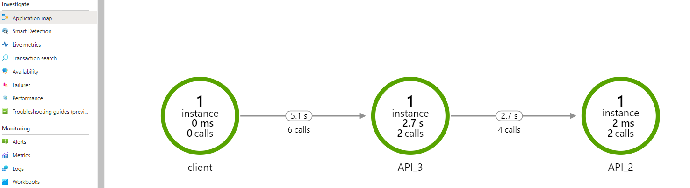

# Overview

This document will give the overview about examples created using AppLogger class.

## Examples

1. **api_1.py**: This example contains the code showing the usage of disabled logger.
1. **api_2.py**: This is a flask api which exposes one rest end point and uses AppLogger
1. **api_3.py**: This is a flask api which exposes one rest end point and uses AppLogger. This rest end point calls:
    1. Rest end point exposed in **api_2.py**
    1. It also calls task1, which is an internal function.
    1. It also calls task2, which is also an internal function.
1. **client**: This is client code which calls:
    1. Rest end point exposed in **api_3.py**
    1. Also calls `util_func` function in **util**  
    It passes the tracer created in `client.py` to util_func as a parent_tracer.

## Usage

Following are the steps to execute the examples:

1. Follow Prerequisites mentioned in [section.](../../README.md#Prerequisites)

1. Get Application Insights Instrumentation Key (app_insights_instrumentation_key) and update it in **logging_config.json**

```json
{
    "logging_enabled":"true",
    "log_level":"INFO",
    "app_insights_key":"<app_insights_instrumentation_key>"
}
```

3. Install pip packages

```bash
pip install -r .\monitoring\requirements.txt
```

4. Execute examples in following sequence:

    1. Run api_2.py flask app

    ```bash
    python .\monitoring\examples\api_2.py 
    ```

    2. Run api_3.py flask app

    ```bash
    python .\monitoring\examples\api_3.py 
    ```

    3. Run client.py 

    ```bash
    python .\monitoring\examples\client.py 
    ```

## Results of executing examples:

1. Execution of `client.py` produces some logs on console
```sh
❯ python .\monitoring\examples\client.py
2021-04-13 14:58:26,399 name=client level=INFO traceId=3ac9716f42b11eb4c9d895b1ce528519 spanId=0000000000000000 Calling api 3
response = b'{\n  "data": "Success API3"\n}\n'
2021-04-13 14:58:31,300 name=util level=INFO traceId=3ac9716f42b11eb4c9d895b1ce528519 spanId=d0c25ebf22957d7e In util_func
cess API3"\n}\n
```

> Note the traceId mentioned in above logs `3ac9716f42b11eb4c9d895b1ce528519`

This `traceid` can be used to filter logs in application insights.

2. Use following Kusto query to filter logs in application insights using traceId got in previous step.

```py
traces
| where operation_Id == '<trace_id>'

```

3. Use following Kusto query to filter dependency tracing using traceId got in the first step.

```py
dependencies
| where operation_Id == '<trace_id>'

```

4. Verify application map in application insights. 
