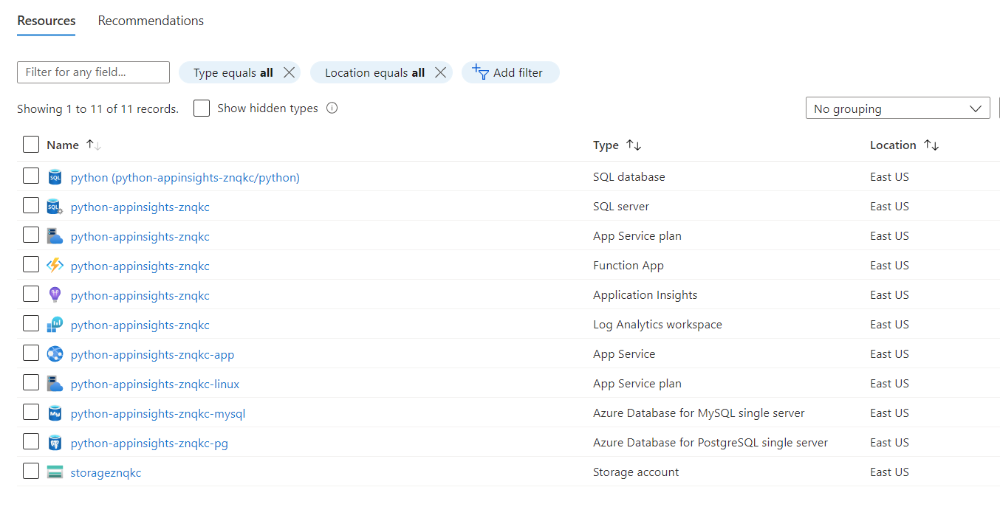

# Getting Started with App Insights for Python via OpenCensus Samples

Many of the samples in this folder support the https://docs.microsoft.com/en-us/azure/azure-monitor/app/opencensus-python articles.  Reference these articles for more information on how OpenCensus works with Python and Application Insights.

## Samples

- [Azure Functions](./azfunc_sample/reademe.md)
- [Django](./django_sample/reademe.md)
- [Flask](./flask_sample/reademe.md)
- [Python (Simple)](./simple_sample/reademe.md)
- [Python (Logger)](./python_logger_opencensus_azure/reademe.md)

## Setup

This procedure configures your Python environment to send telemetry to the Application Insights feature of the Azure Monitor service with the OpenCensus Azure monitor exporters.  It works with any Python application on-premises or in the cloud.

## Prerequisites

To get started with the following samples, you need to:

- Install Python (all of the samples have been tested to work with version 3.9.x and the Azure resources are deployed using 3.9).
- Install the latest version of Visual Studio Code with the following extensions.
  - [ms-python.python](https://marketplace.visualstudio.com/items?itemName=ms-python.python)
  - [ms-azuretools.vscode-azurefunctions](https://marketplace.visualstudio.com/items?itemName=ms-azuretools.vscode-azurefunctions)
- Install [Azure Functions Core Tools](https://docs.microsoft.com/en-us/azure/azure-functions/functions-run-local?tabs=v4%2Cwindows%2Ccsharp%2Cportal%2Cbash#install-the-azure-functions-core-tools)
- Create a [free Azure account](https://azure.microsoft.com/free/) if you don't already have an Azure subscription.
- Install [Azure Storage Emulator](https://docs.microsoft.com/en-us/azure/storage/common/storage-use-emulator) (for local testing)

## Deploy the environment

- Open a Windows PowerShell window.
- Run the following:

```Powershell
cd $home;

rm -r python-appinsights -f

git clone https://github.com/Azure-Samples/azure-monitor-opencensus-python python-appinsights
```

- Open Visual Studio Code to the cloned repositiory.
- Open a new Windows PowerShell window, run the following:

```powershell
cd azure_monitor/artifacts

setup.ps1
```

- This will deploy the ARM template that contains all the necesary resources needed to run these samples.  
  - Reference the `template.json` file for the ARM template that is deployed.  It contains the following resources:

    

- It will also update the environment files for the sample files with the specific connection string details from the deployment to speed up your sample exploration.
- Additionally it will download sample files from the [OpenCensus Python](https://github.com/census-instrumentation/opencensus-python) repo.

## Configure the environment (Azure)

- In the Azure Portal, browse to the `python-insights-SUFFIX` Azure Database for SQL.
- Under **Security**, select **Networking**.
- Under **Firewall rules**, select to **Add your client IPv4 address(xx.xx.xx.xx)**.
- Check the **Allow Azure services and resources to access this server**.
- Select **Save**.

- Setup local MySQL connectivity
  - Browse to the Azure Portal.
  - Select your lab subscription and resource group.
  - Select the **python-appinsights-SUFFIX-mysql** MySQL resource.
  - Under **Settings**, select **Connection security**.
  - Select the **Yes** toggle for the **Allow access to Azure Services**.
  - Select **Add current client IP address**.
  - Select **Save**.

- Setup local PostgresSQL connectivity
  - Browse to the Azure Portal.
  - Select your lab subscription and resource group.
  - Select the **python-appinsights-SUFFIX-mysql** PostgreSQL resource.
  - Under **Settings**, select **Connection security**.
  - Select the **Yes** toggle for the **Allow access to Azure Services**.
  - Select **Add client IP**.
  - Select **Save**.

## Configure the environment (Visual Studio Code)

- Open Visual Studio code, select the **Extensions** tab.
- Ensure the following extensions are installed:
  - [ms-python.python](https://marketplace.visualstudio.com/items?itemName=ms-python.python)
  - [ms-azuretools.vscode-azurefunctions](https://marketplace.visualstudio.com/items?itemName=ms-azuretools.vscode-azurefunctions)

## Check your Python Version

- In Visual Studio Code, open a Terminal window, run the following command:

```powershell
python.exe --version
```

- For Python, make sure you see version 3.9.x.  If you do not, do the following:
  - Download Python and change your path variables to point to the proper version.
  - Restart Visual Studio Code.
- Open the command palette by selecting **View->Command Pallet**.
- Run the `Python: Select interperter` command.
- Select the `Python 3.9.x` version.

## Create a Python environment

- Switch to the terminal window, ensure you are in the `azure_monitor` folder
- Run the following command to create an environment where you can load all the dependencies:

```powershell
py -3 -m venv .venv
.venv\scripts\activate
```

- If prompted, select **yes**.
- Ensure that you select the new environment in the interpertor selection otherwise the python commands you run later may not map to the proper python version.

## Install OpenCensus

[OpenCensus](https://opencensus.io/) is a set of open source libraries hosted on [GitHub](https://github.com/census-instrumentation) that are used to capture trace and metric data from applications.

Metrics can be things like latency, HTTP request and reponse lengths whereas distributed tracing shows how a request moves through your application layers and other services. Log data represents user generated logs that can be enriched with context and custom dimensions. Graphs can be built to show how an application or service is performing based on these data points.

To install OpenCensus:

- Open a terminal window, run the following:

```powershell
python -m pip install --upgrade pip

python -m pip install opencensus
```

## Install Azure exporter

OpenCensus needs an exporter to know how to send the log, metric and tracing data to a specific backend.  Azure provides an exporter for Azure Monitor and Log Analytics.

To install the Azure monitor exporter package:

- Open a terminal window, run the following:

```powershell
python -m pip install opencensus-ext-logging
python -m pip install opencensus-ext-azure
python -m pip install opencensus-extension-azure-functions
python -m pip install opencensus-ext-requests
python -m pip install pyodbc
python -m pip install psutil
```

## Configure environment variables

- Open the `.\azure_monitor\.env` file notice that as part of the setup the values have been copied into the environment file.  
- Browse to the Azure Portal.
- Select the Application Insights **python-appinsights-SUFFIX** resource.
- On the **Overview** page, copy the connection string. Be sure to verify that the values match in the `.env` file
