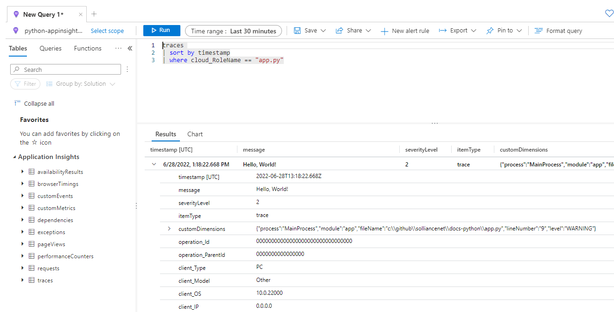
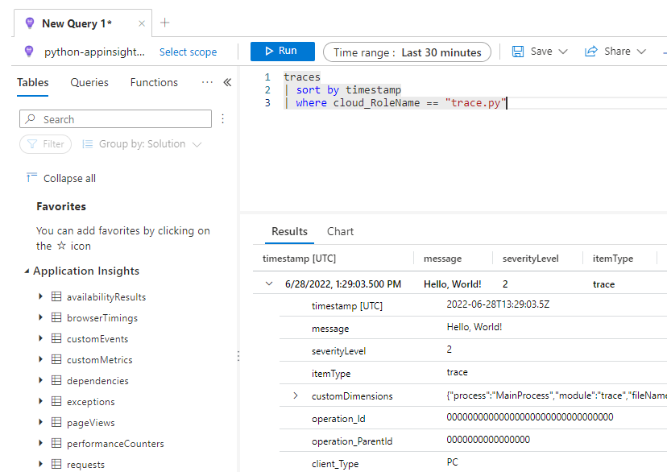
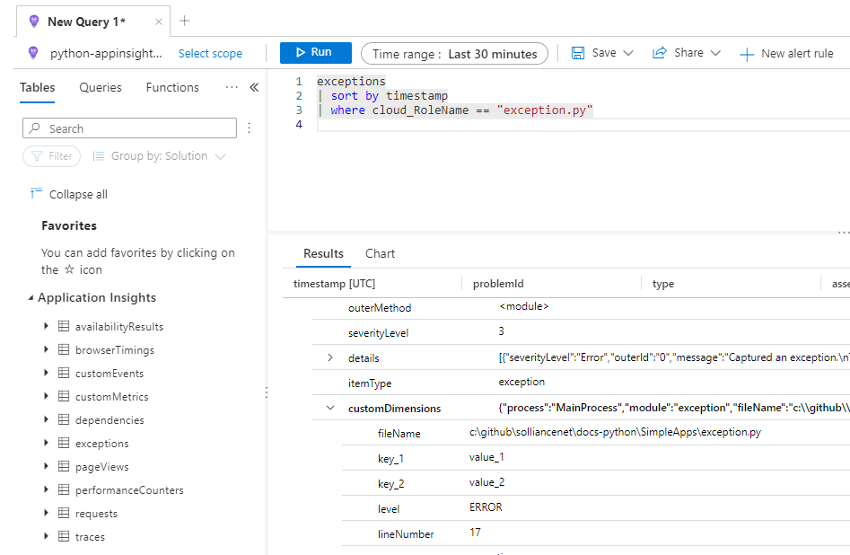

# Getting Started with App Insights for Python via OpenCensus Azure monitor exporters

This procedure configures your Python application to send telemetry to the Application Insights feature of the Azure Monitor service with the OpenCensus Azure monitor exporters.  It works with any Python application on-premises or in the cloud.

## Prerequisites

To get started with the following samples, you need to:

- Install Python (version 3.9.x).
- Install the latest version of Visual Studio Code with the following extensions.
  - [ms-python.python](https://marketplace.visualstudio.com/items?itemName=ms-python.python)
  - [ms-azuretools.vscode-azurefunctions](https://marketplace.visualstudio.com/items?itemName=ms-azuretools.vscode-azurefunctions)
- Install [Azure Functions Core Tools](https://docs.microsoft.com/en-us/azure/azure-functions/functions-run-local?tabs=v4%2Cwindows%2Ccsharp%2Cportal%2Cbash#install-the-azure-functions-core-tools)
- Create a [free Azure account](https://azure.microsoft.com/free/) if you don't already have an Azure subscription.
- [Azure Storage Emulator](https://docs.microsoft.com/en-us/azure/storage/common/storage-use-emulator) (for local testing)

## Deploy the environment

- Open a Windows PowerShell window
- Run the following:

```Powershell
cd $home;

rm -r python-appinsights -f

git clone https://github.com/Azure-Samples/azure-monitor-opencensus-python python-appinsights
```

- Open Visual Studio Code to the cloned repositiory
- Open a new Windows PowerShell window, run the following:

```powershell
cd docs_samples

setup.ps1
```

- This will deploy the ARM template that contains all the necesary resources needed to run these samples.  It will also update the environment files with the specific connection string details.

## Configure the environment (Azure)

- In the Azure Portal, browse to the `python-insights-SUFFIX` Azure Database for SQL
- Under **Security**, select **Networking**
- Under **Firewall rules**, select to **Add your client IPv4 address(xx.xx.xx.xx)**
- Check the **Allow Azure services and resources to access this server**
- Select **Save**

- Setup local MySQL connectivity
  - Browse to the Azure Portal
  - Select your lab subscription and resource group
  - Select the **python-appinsights-SUFFIX-mysql** MySQL resource
  - Under **Settings**, select **Connection security**
  - Select the **Yes** toggle for the **Allow access to Azure Services**
  - Select **Add client IP**
  - Select **Save**

- Setup local PostgresSQL connectivity
  - Browse to the Azure Portal
  - Select your lab subscription and resource group
  - Select the **python-appinsights-SUFFIX-mysql** PostgreSQL resource
  - Under **Settings**, select **Connection security**
  - Select the **Yes** toggle for the **Allow access to Azure Services**
  - Select **Add client IP**
  - Select **Save**

## Configure the environment (Visual Studio Code)

- Open Visual Studio code, select the **Extensions** tab
- Ensure the following extensions are installed:
  - ms-python.python
  - ms-azuretools.vscode-azurefunctions

## Check your Python Version

- In Visual Studio Code, open a Terminal window, run the following command:

```powershell
python.exe --version
```

- For Python, make sure you see version 3.9.x.  If you do not, do the following:
  - Download Python and change your path variables to point to the proper version
  - Restart Visual Studio Code
- Open the command palette by selecting **View->Command Pallet**
- Run the `Python: Select interperter` command
- Select the `Python 3.9.x` version

## Create a Python environment

- Run the following command to create an environment where you can load all the dependencies:

```powershell
py -3 -m venv .venv
.venv\scripts\activate
```

- When prompted, select **yes**
- Ensure that you select the new environment in the interpertor selection otherwise the python commands you run later may not map to the proper python version.

## Install OpenCensus

[OpenCensus](https://opencensus.io/) is a set of open source libraries hosted on [GitHub](https://github.com/census-instrumentation) that are used to capture trace and metric data from applications.

Metrics can be things like latency, HTTP request and reponse lengths whereas traces are how a request moves through your application layers and other services. Graphs can be built to show how an application or service is performing based on these data points.

To install OpenCensus:

- Open a terminal window, run the following:

```powershell
python -m pip install --upgrade pip

python -m pip install opencensus
```

## Install Azure exporter

OpenCensus needs an exporter to know how to send the log and metric data to a specific backend.  Azure provides an exporter for Azure Monitor.

To install the Azure monitor exporter package:

- Open a terminal window, run the following:

```powershell
python -m pip install opencensus-ext-logging
python -m pip install opencensus-ext-azure
python -m pip install opencensus-extension-azure-functions
python -m pip install opencensus-ext-requests
python -m pip install pyodbc
python -m pip install psutil
```

## Configure middleware to track requests

- Browse to the Azure Portal
- Select the Application Insights **python-appinsights-SUFFIX** resource
- On the **Overview** page, copy the connection string
- Open the `.\docs_sampes\.env` file notice that as part of the setup the values have been copied into the environment file

## Create a simple Python App

- Create a new python file called `app.py`.
- Copy the following into it, be sure to replace your Application Insights connection string that you copied above:

```python
import logging

from opencensus.ext.azure.log_exporter import AzureLogHandler

logger = logging.getLogger(__name__)

logger.addHandler(AzureLogHandler(connection_string='InstrumentationKey=<your-instrumentation_key-here>'))

logger.warning('Hello, World!')
```

- Press **F5** to run the file, select **Python file** in the debug configuration window
- If you get an error about `psutil._psutil_windows` do the following:
  - Open the `.venv\Lib\site-packages` folder and delete the `psutil` and `psutil-5.9.1.dist-info` folders
  - Then run the following:

    ```Python
    python -m pip install --upgrade pip
    python -m pip install psutil
    ```

- Switch to the Azure Portal, navigate to your Application Insights resource
- Under **Monitoring**, select **Logs**
- Run the following kusto query:

```kusto
traces
| sort by timestamp
| where cloud_RoleName == "app.py"
```

- You should see the following:

  

## Sending trace data

- Open the `./docs_samples/SimpleApps/trace.py` file, notice that the connection string is being pulled from an environment variable rather than being hard coded.
- Press **F5** to run the file
- Switch to the Azure Portal
- Browse to your lab resource group
- Browse to the `python-appinsights-SUFFIX` application insights resource and select it
- Under **Monitoring**, select **Logs**
- Run the following Kusto query to see the `traces` sent to application insights:

```kql
traces
| sort by timestamp
| where cloud_RoleName == "trace.py"
```

- You should see your trace in the **message** column:

  

- For your trace item notice that some of the columns are empty, but others (such as `cloud_RoleName`, `cloud_RoleInstance` and `client_*`) are populated based on the client information from the SDK.

## Capture exceptions and custom dimensions

- Switch back to your Visual Studio Code window
- Select the `./SimpleApps/exception.py` file
- Press **F5** to run the file, select **Python file** in the debug configuration window
- Switch to the Azure Portal
- Browse to your lab resource group
- Browse to the `python-appinsights-SUFFIX` application insights resource and select it
- Under **Monitoring**, select **Logs**
- Run the following Kusto query to see the `exception` sent to application insights:

```kql
exceptions
| sort by timestamp
| where cloud_RoleName == "exception.py"
```

- Expand your exception item, notice the `details` column has the exception details you would expect, but also expand the `customDimensions` column to review the custom data that was sent to the application insights table.

  

