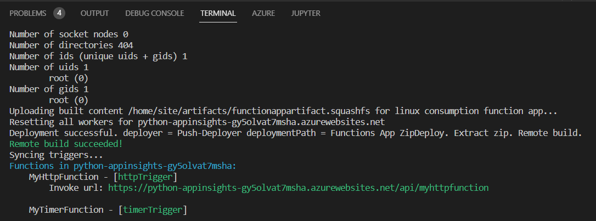

# Capture Dependencies

You can utilize opencensus to send dependencies like database calls and other log supporting items to Application Insights automatically.

## Configuring Function Apps

This is an example of how to add the various settings to an Azure Function application to send dependencies calls to Azure Monitor.  You will run the samples both locally and deploy the Azure Functions to an Azure App Service resource you deployed as part of the setup script.

## Utilize Function Apps with OpenCensus

- Start the Azure Storage Emulator
- Switch to Visual Studio Code
- Open a terminal window, run the following commands to start the Python functions locally:

```powershell
cd .\docs_samples\Functions

python -m pip install -r requirements.txt

func start
```

- Browse to the HTTP function endpoint `http://localhost:7071/api/MyHttpFunction`
- Run the following command to deploy the function apps to Azure. Be sure to replace the `SUFFIX` below (you can find it in the deployed Azure Portal resource group or in the `.\docs_samples\suffix.txt` file that was generated by the setup script):

```powershell
cd .\docs_samples\Functions

az login

func azure functionapp publish python-appinsights-SUFFIX   
```

- You should see the two function applications deployed successfully:

  

- Switch to the Azure Portal
- Navigate to the **python-appinsights-SUFFIX** function app
- Under **Functions**, select **Functions**, you should see the two python function apps deployed

> **NOTE** Azure Function runtimes support various Python versions depending on the version selected.  See [Languages by runtime version](https://docs.microsoft.com/en-us/azure/azure-functions/supported-languages#languages-by-runtime-version).

- Review the function app code.  Notice the usage of the a storage account and a call to the database.
- Navigate to the **python-appinsights-SUFFIX** Application Insights resource, under **Monitoring**, select **Logs**
- Run the following query:

```kusto
dependencies
```

- You should see the dependencies displayed for the calls to MySQL and Azure storage displayed.

## Configuring Django applications

This next example shows how to add the various OpenCensus settings to a Django application to send logging and metric data to Azure Monitor.  You will run the samples both locally and deploy the Django web application to the Azure App Service resource you deployed as part of the setup script.

- Run the following commands to setup the environment:

```powershell
cd $home
cd .\docs_samples\WebSample
```

```python
python -m pip install django
python -m pip install python-dotenv
python -m pip install opencensus-ext-django
python -m pip install opencensus-ext-postgresql

python -m pip install -r requirements.txt
```

- The following items have been done for you in the ARM template:
  - System assigned managed identity for the app service is enabled
  - Storage Blob Data Contributor has been assigned to the managed identity

- Setup local PostgreSQL connectivity
  - Browse to the Azure Portal
  - Select your lab subscription and resource group
  - Select the **python-appinsights-SUFFIX-pg** Postgres SQL resource
  - Under **Settings**, select **Connection security**
  - Select **Add client IP**
  - Select **Save**

- Setup the Application insights middleware
  - Open the `./docs_samples/WebSample/azureproject/settings.py` file
  - Ensure the following line is present in the `MIDDLEWARE` section:

```python
'opencensus.ext.django.middleware.OpencensusMiddleware',
```

-- Ensure the following `OPENCENSUS` section is present in the `settings.py` file.

```python
OPENCENSUS = {
    'TRACE': {
        'SAMPLER': 'opencensus.trace.samplers.ProbabilitySampler(rate=1)',
        'EXPORTER': 'opencensus.ext.azure.trace_exporter.AzureExporter(connection_string="' + appKey + '")',
    }
}
```

- Create the database schema:

```python
py manage.py migrate
```

- If you get an error about `psutil._psutil_windows` do the following:
  - Open the `.venv\Lib\site-packages` folder and delete the `psutil` and `psutil-5.9.1.dist-info` folders
  - Then run the following:

    ```Python
    python -m pip install --upgrade pip
    python -m pip install psutil
    ```

- Run the application and test the logging

```python
python manage.py runserver
```

- Open a web browser to `http://127.0.0.1:8000/`
- Add a new resturant
  - Select **Add new resturant**
  - For the name, type `Contoso BBQ`
  - For the address, type `1 Microsoft Way`
  - For the description, type `BBQ`
  - Select **Submit**, the resturant will be created.
  - Select **Add new review**
  - Type a name
  - Select a rating
  - Add a comment
  - Choose a random picture
  - Select **Save changes**

- Switch to the Azure Portal
- Browse to the **python-applicationinsights-SUFFIX** Application Insights resource
- Under **Monitoring**, select **Logs**
- In the query window, type the following:

```kql
requests 
| where cloud_RoleName == "manage.py"
```

- Select **Run**, you should see the following:

  

- Select the **Azure** icon in the toolbar of Visual Studio code
- If prompted, select **Sign in to Azure..** and follow the prompts
- Expand **Resources**, if needed, sign-in to Azure
- Expand your target lab subscription
- Expand **App Services**
- Locate the target web app to deploy too, this will be **python-appinsights-SUFFIX-app**
  - If needed, select **Install extension to enable additional features**, then select **Install** to instal the Azure App Service extension
- In Visual Studio Code, right-click the **WebSample** folder, select **Deploy to web app**
- Selec the **python-appinsights-SUFFIX-app** web app
- If prompted, select **Deploy**
- Browse to the **python-appinsights-SUFFIX-app.azurewebsites.net** web site, the site should load successfully.
- Add some more resturants and reviews, this will cause log data to be sent to Azure Monitor via OpenCensus.
