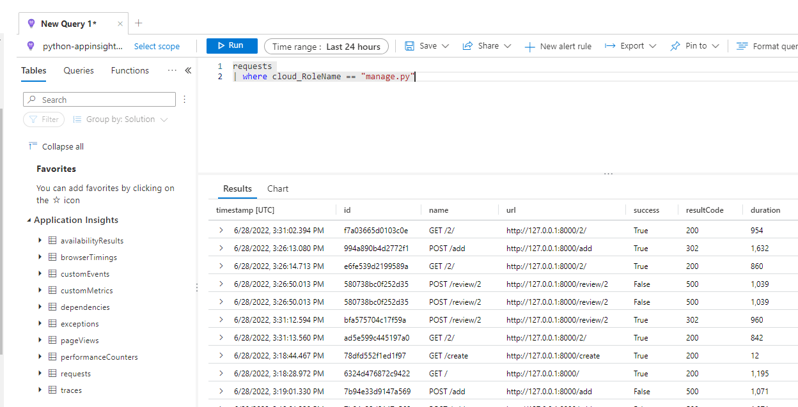

# Capture Dependencies

You can utilize opencensus to send dependencies like database calls and other items to Application Insights.  This is an example of how to add the various settings to a Django application to do exactly that.

## Configuring Django applications

- Run the following commands to setup the environment:

```powershell
cd $home
cd docs-python\WebSample
```

```python
python -m pip install django
python -m pip install python-dotenv
python -m pip install opencensus-ext-django
python -m pip install opencensus-ext-postgresql

python -m pip install -r requirements.txt
```

- The following items have been done for you in the ARM template:
  - System assigned managed identity for the app service is enabled
  - Storage Blob Data Contributor has been assigned to the managed identity

- Update the `.env` file with the PostgreSQL and storage settings, be sure to replace `SUFFIX` and `PASSWORD`:
  - Set DBNAME = `python`
  - Set DBHOST = `python-appinsights-SUFFIX-pg.postgres.database.azure.com`
  - Set DBUSER = `wsuser@python-appinsights-SUFFIX-pg`
  - Set DBPASS = `PASSWORD`
  - STORAGE_ACCOUNT_NAME = `storageSUFFIX`
  - STORAGE_CONTAINER_NAME = `photos`

- Setup local PostgreSQL connectivity
  - Browse to the Azure Portal
  - Select your lab subscription and resource group
  - Select the **python-appinsights-SUFFIX-pg** Postgres SQL resource
  - Under **Settings**, select **Connection security**
  - Select **Add client IP**
  - Select **Save**

- Setup the Application insights middleware
  - Browse to the Azure Portal
  - Select your lab subscription and resource group
  - Select the **python-appinsights-SUFFIX** Application insights resource
  - Copy the connection string
  - Open the `./WebSample/azureproject/settings.py` file
  - Add the following line in the `MIDDLEWARE` section:

```python
'opencensus.ext.django.middleware.OpencensusMiddleware',
```

-- Add the following `OPENCENSUS` section to the `settings.py` file.  Replace the instrumentation key:

```python
OPENCENSUS = {
    'TRACE': {
        'SAMPLER': 'opencensus.trace.samplers.ProbabilitySampler(rate=1)',
        'EXPORTER': 'opencensus.ext.azure.trace_exporter.AzureExporter(connection_string="' + appKey + '")',
    }
}
```

- Create the database schema:

```python
py manage.py migrate
```

- Run the application and test the logging

```python
python manage.py runserver
```

- Open a web browser to `http://127.0.0.1:8000/`
- Add a new resturant
  - Select **Add new resturant**
  - For the name, type `Contoso BBQ`
  - For the address, type `1 Microsoft Way`
  - For the description, type `BBQ`
  - Select **Submit**, the resturant will be created.
  - Select **Add new review**
  - Type a name
  - Select a rating
  - Add a comment
  - Choose a random picture
  - Select **Save changes**

- Switch to the Azure Portal
- Browse to the **python-applicationinsights-suffix** Application Insights resource
- Under **Monitoring**, select **Logs**
- In the query window, type the following:

```kql
requests 
| where cloud_RoleName == "manage.py"
```

- Select **Run**, you should see the following:

  

- Select the **Azure** icon in the toolbar of Visual Studio code
- If prompted, select **Sign in to Azure..** and follow the prompts
- Expand **Resources**, if needed, sign-in to Azure
- Expand your target lab subscription
- Expand **App Services**
- Locate the target web app to deploy too, this will be **python-appinsights-SUFFIX-app**
  - If needed, select **Install extension to enable additional features**, then select **Install** to instal the Azure App Service extension
- In Visual Studio Code, right-click the **WebSample** folder, select **Deploy to web app**
- Selec the **python-appinsights-SUFFIX-app** web app
- If prompted, select **Deploy**
- Browse to the **python-appinsights-SUFFIX-app.azurewebsites.net** web site, the site should load successfully.
