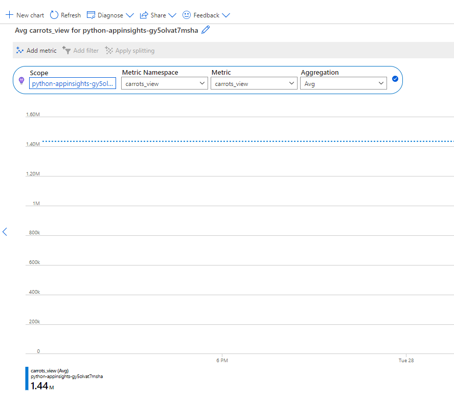
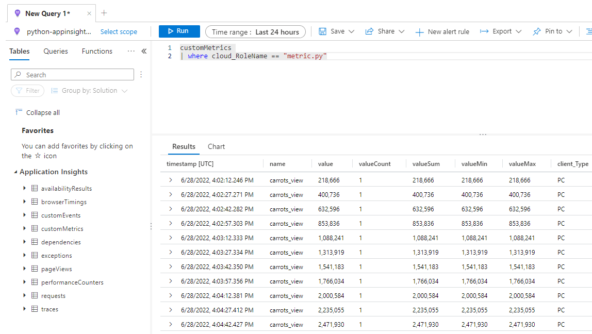
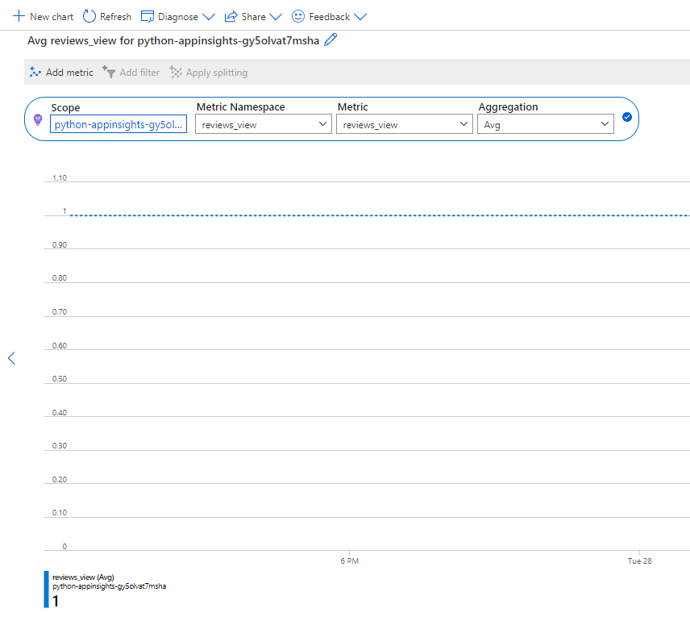

# Capture Custom Metrics

Custom metrics are helpful for reporting on specific metric values from your application.  These are typically made up of the metric name and the value.  This data will then be placed into the `customMetrics` table in Application Insights.

## Simple Application

- Open the `./SimpleApps/metric.py` file.
- Press **F5** to run the file, select **Python file** in the debug configuration window.
- Switch to the Azure Portal.
- Browse to your lab resource group.
- Browse to the `python-appinsights-SUFFIX` application insights resource and select it.
- Under **Monitoring**, select **Metrics**.
- For the **Metric namespace**, select **carrots_view**.
- For the **Metric**, select **carrots_view**.
- You should see some data displayed:

    

- Stop the application.

- You can user kusto queries to get metric data:
  - Under **Montioring**, select **Logs**.
  - Run the following query:

```kusto
customMetrics 
| where cloud_RoleName == "metric.py"
```

- You should see the metric value is recorded every 15 seconds:

    

## Web Application

For the sample resturant application, you have two places where metrics are sent to Application Insights.

- Single Value - The number of resturants created.
- Aggregation - Page views over a one minute time period.

- Switch to the Azure Portal and the application insights instance.
- Under **Monitoring**, select **Metrics**.
- For the **Metric namespace**, select **reviews_view**.
- For the **Metric**, select **reviews_view**.
- You should see some data displayed for the reviews made from the web site:

    